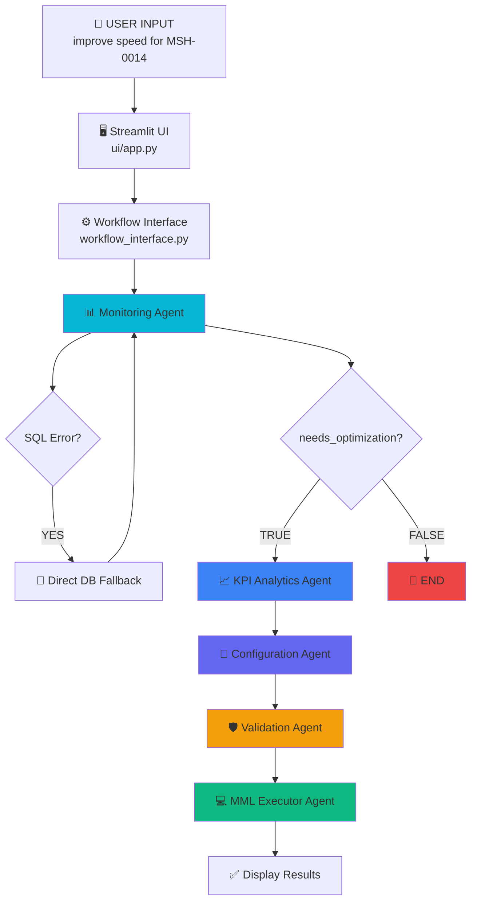
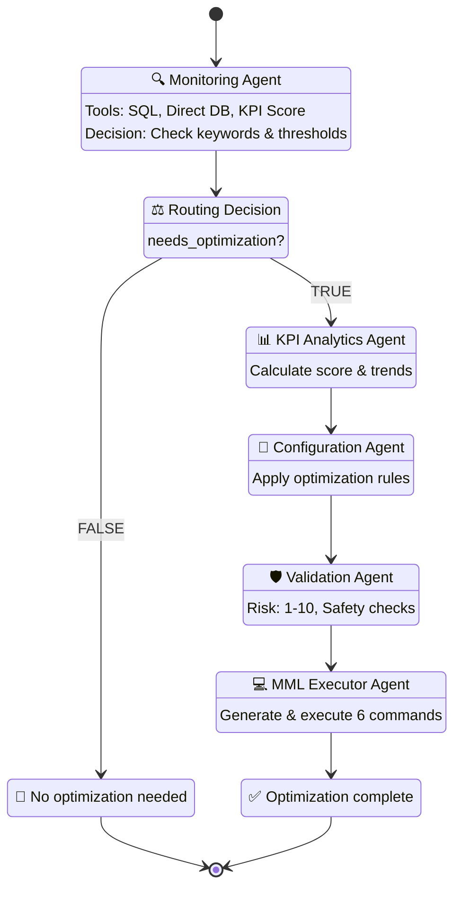

# Visual AI Prompt for Architecture Diagrams

**Project:** Liquid Zimbabwe 4G Network Optimizer
**Purpose:** Generate professional architecture diagrams for technical documentation

---

## Diagram 1: Data Flow Diagram - User Query to Optimization

**Style:** Modern technical flowchart with gradient boxes, clean lines, and icons

**Prompt for Visual AI:**

```
Create a vertical flowchart diagram showing the data flow for a telecom network optimization system. Use a modern tech aesthetic with blue/cyan gradients for boxes, orange for warnings, and green for success states.

LAYOUT (Top to Bottom):

1. TOP - User Input Layer (Light Blue Rectangle)
   - Icon: Person/User icon
   - Text: "USER INPUT"
   - Subtext: 'improve speed for MSH-0014-Chipadze'
   - Arrow down labeled "1. User submits query"

2. Streamlit UI Layer (Gradient Blue Box)
   - Icon: Browser/Window icon
   - Text: "Streamlit UI"
   - Subtext: "ui/app.py"
   - Arrow down labeled "2. Parse input" with bullet points:
     • site_name = "MSH-0014-Chipadze"
     • user_query = "improve speed..."

3. Workflow Interface Layer (Purple Gradient Box)
   - Icon: Gear/Settings icon
   - Text: "Workflow Interface"
   - Subtext: "workflow_interface.py"
   - Arrow down labeled "3. Initialize state"

4. LARGE CENTER SECTION - Agent Workflow (Gray Container Box with rounded corners)
   - Title: "AGENT WORKFLOW" (top of container)

   Inside this container, arrange 6 connected boxes in a linear flow:

   a) Monitoring Agent (Cyan Box)
      - Icon: Magnifying glass
      - Title: "Monitoring Agent"
      - Bullets:
        • Query KPIs
        • Check Thresholds
        • FALLBACK: Direct DB Query
        • User Intent Detection
      - Arrow down labeled "5. SQL Error?" with YES path looping back
      - Arrow down labeled "6-8. DECISION: needs_optimization = TRUE"

   b) KPI Analytics Agent (Blue Box)
      - Icon: Chart/Graph
      - Title: "KPI Analytics Agent"
      - Bullets:
        • Calculate weighted score
        • Analyze trends
        • Identify root cause
      - Arrow down labeled "9-10. Primary KPI Issue: Download Speed"

   c) Configuration Agent (Indigo Box)
      - Icon: Wrench/Tool
      - Title: "Configuration Agent"
      - Bullets:
        • Apply optimization rules
        • Few-shot learning
        • Calculate changes
      - Arrow down labeled "11-12. Recommendation: reference_signal_power -200→-180"

   d) Validation Agent (Orange Box)
      - Icon: Shield/Check
      - Title: "Validation Agent"
      - Bullets:
        • Safety checks
        • Risk scoring (1-10)
        • Range validation
      - Arrow down labeled "13-14. Status: APPROVED (Risk: 4/10)"

   e) MML Executor Agent (Green Box)
      - Icon: Terminal/Code
      - Title: "MML Executor Agent"
      - Bullets:
        • Generate 6 MML commands
        • Execute sequentially
        • Log to database
      - Arrow down labeled "15-16. Commands: MOD PDSCHCFG:... (x6)"

5. BOTTOM - Result Layer (Split into two boxes)
   - Left Box (Purple): "Workflow Interface - Format response"
   - Right Box (Light Blue): "Streamlit UI - Show results"
   - Final arrow labeled "17-18. Display to user"

STYLING REQUIREMENTS:
- Use a light background (white or very light gray)
- Each box should have a subtle drop shadow
- Arrows should be bold with arrowheads
- Use icons from a tech icon set (Font Awesome style)
- Add small numbered circles (1, 2, 3...) at each step
- Make the "Agent Workflow" container stand out with a dashed border
- Use color coding:
  • Blue tones for data/analysis
  • Orange for validation/caution
  • Green for execution/success
  • Purple for orchestration
- Font: Clean sans-serif (like Inter or Roboto)
```

---

## Diagram 2: Agent Workflow State Machine

**Style:** State machine diagram with circular states and directional arrows

**Prompt for Visual AI:**

```
Create a detailed state machine flowchart for an AI agent workflow in a telecom network optimization system. Use a professional technical style with circular/rounded states and clear decision diamonds.

LAYOUT (Vertical flow with branches):

1. START STATE (Top - Green Circle)
   - Icon: Play button
   - Text: "START"
   - Arrow down with label: "State: {site_name, cell_id, user_query, ...}"

2. MONITORING AGENT (Large Cyan Rectangle with rounded corners)
   - Title: "MONITORING AGENT"
   - Icon: Radar/Monitor
   - Left panel (Tools):
     • execute_lz_kpi_sql
     • get_latest_kpis_direct ⚡
     • calc_weighted_kpi_score
     • calc_kpi_trend
   - Right panel (Decision Logic):
     needs_opt = (
       "OPTIMIZE" in output OR
       "BELOW" in output OR
       "IMPROVE" in user_query OR
       "SPEED" in user_query OR
       "COVERAGE" in user_query
     )
   - Arrow down labeled: "Update state: needs_optimization = True/False"

3. ROUTING DECISION (Orange Diamond)
   - Text: "ROUTING DECISION"
   - Inside diamond: "needs_optimization?"
   - Two arrows emerging:
     • LEFT arrow (Red): labeled "False" → goes to END
     • RIGHT arrow (Green): labeled "True" → continues down

4. BRANCHING PATHS:

   LEFT BRANCH (needs_opt = False):
   - END STATE (Red Circle)
     - Icon: Stop sign
     - Text: "END"
     - Subtext: "Return: 'No optimization needed'"

   RIGHT BRANCH (needs_opt = True):
   Continue vertical flow with these states:

5. KPI ANALYTICS AGENT (Blue Rectangle)
   - Icon: Chart
   - Title: "KPI ANALYTICS AGENT"
   - Tools section:
     • calc_weighted_kpi_score
     • calc_kpi_trend
     • execute_lz_kpi_sql
   - Output section:
     • Primary KPI issue
     • Weighted score
     • Tier breakdown
   - Arrow down: "State: primary_kpi_issue"

6. CONFIGURATION AGENT (Indigo Rectangle)
   - Icon: Settings
   - Title: "CONFIGURATION AGENT"
   - Tools section:
     • query_huawei_parameter
     • execute_historical_sql
     • validate_parameter_range
   - Rules section (smaller text):
     • Low speed → ↑ signal pwr
     • High load → ↑ aggregation
     • Poor quality → ↑ PDCCH
   - Output section:
     • Parameter changes
     • Expected improvements
     • Confidence level
   - Arrow down: "State: config_output"

7. VALIDATION AGENT (Orange Rectangle)
   - Icon: Shield
   - Title: "VALIDATION AGENT"
   - Tools section:
     • validate_parameter_range
     • assess_risk_score
     • validate_optimization_safety
   - Checks section:
     • Range validation
     • Risk scoring (1-10)
     • Conflict detection
   - Decision section:
     • APPROVED (risk ≤ 7)
     • REVIEW (risk = 8)
     • REJECTED (risk ≥ 9)
   - Arrow down: "State: validation_status"

8. MML EXECUTOR AGENT (Green Rectangle)
   - Icon: Terminal
   - Title: "MML EXECUTOR AGENT"
   - Tools section:
     • modify_huawei_parameter
     • execute_mml_command
     • query_huawei_kpi
   - Process section (numbered list):
     1. Generate 6 MML commands
     2. Execute sequentially
     3. Log to database
     4. Verify changes
     5. Rollback on failure
   - Output section:
     • Execution status
     • Pre/post KPI comparison
     • Success metrics
   - Arrow down: "State: optimization_success"

9. FINAL END STATE (Green Circle)
   - Icon: Checkmark
   - Text: "END"
   - Subtext: "Return final state"

VISUAL ELEMENTS:
- Add a light gray background container around the entire workflow
- Use dashed lines to show the state flow path
- Add small "State" labels on arrows showing what data is passed
- Use gradient fills for agent boxes (darker at top, lighter at bottom)
- Add subtle shadows behind each state box
- Draw a red path from ROUTING DECISION to END for the "False" case
- Draw a green highlighted path for the "True" optimization flow
- Add small numbered circles (1-9) next to each major state
- Include a legend in bottom right:
  • Green path = Optimization triggered
  • Red path = No optimization needed
  • Orange diamond = Decision point
  • Rectangles = Agent states
  • Circles = Terminal states

STYLING:
- Modern flat design with subtle depth
- Light background (#F5F7FA)
- Clean sans-serif font (Roboto or Inter)
- Use consistent spacing between elements
- Add icons using a tech icon set (like Lucide or Heroicons)
- Color palette:
  • Cyan (#06B6D4) - Monitoring
  • Blue (#3B82F6) - Analytics
  • Indigo (#6366F1) - Configuration
  • Orange (#F59E0B) - Validation
  • Green (#10B981) - Execution
  • Red (#EF4444) - Stop/End
```

---

## Diagram 3: 3-Tier Fallback Mechanism (Bonus)

**Style:** Layered architecture diagram showing error handling tiers

**Prompt for Visual AI:**

```
Create a layered architecture diagram showing a 3-tier fallback mechanism for an AI-powered system. Use a stacked layout with each tier as a horizontal band.

LAYOUT (Top to Bottom):

1. TIER 1 - Primary System (Green Band - Full width)
   - Left side: Icon (Robot/AI)
   - Title: "TIER 1: LLM Agent (Primary)"
   - Process flow (left to right):
     → "Try: agent.invoke() with SQL generation"
     → "Detect: ERROR + SQL in output"
     → "Result: ✓ Success" OR "⚠️ Fail → TIER 2"
   - Status badge (right): "PREFERRED"

2. ARROW DOWN (Red arrow with "Fallback" label)

3. TIER 2 - Fallback System (Orange Band - Full width)
   - Left side: Icon (Database)
   - Title: "TIER 2: Direct Database Fallback"
   - Process flow (left to right):
     → "Execute: get_latest_kpis_direct(site, cell)"
     → "Check: KPI thresholds"
     → "Build: Structured output with tags"
     → "Result: ✓ Success" OR "⚠️ Fail → TIER 3"
   - Status badge (right): "RELIABLE"

4. ARROW DOWN (Red arrow with "Last Resort" label)

5. TIER 3 - Safety Net (Yellow Band - Full width)
   - Left side: Icon (Shield/Star)
   - Title: "TIER 3: User Intent Detection"
   - Process flow (left to right):
     → "Parse: User query for keywords"
     → "Match: OPTIMIZE, IMPROVE, FIX, ENHANCE..."
     → "Force: needs_optimization = True"
     → "Result: ✓ Always succeeds"
   - Status badge (right): "GUARANTEED"

VISUAL ELEMENTS:
- Each tier should be a horizontal band with rounded corners
- Add subtle gradients (darker on left, lighter on right)
- Include small checkmark (✓) and warning (⚠️) icons
- Draw vertical dashed lines showing the fallback cascade
- Add a sidebar on the left with tier numbers (1, 2, 3)
- Include success rate indicators:
  • TIER 1: "~70% success rate"
  • TIER 2: "~99% success rate"
  • TIER 3: "100% success rate"
- Add timing information:
  • TIER 1: "30-300 seconds"
  • TIER 2: "5-10 seconds"
  • TIER 3: "< 1 second"

STYLING:
- Light background
- Each tier uses a different color:
  • Tier 1: Green (#10B981) to light green gradient
  • Tier 2: Orange (#F59E0B) to light orange gradient
  • Tier 3: Yellow (#FCD34D) to light yellow gradient
- White text on colored backgrounds
- Drop shadows for depth
- Clean, modern design
```

---

## Usage Instructions

### For Automated Visual Creators (like DALL-E, Midjourney, or Diagram Tools):

1. **Copy the specific prompt** for the diagram you want to create
2. **Paste into the AI tool** (e.g., ChatGPT with DALL-E, Claude with artifacts, Midjourney, etc.)
3. **Specify output format**:
   - For presentations: "Export as high-resolution PNG (300 DPI)"
   - For documentation: "Export as SVG for scalability"
   - For web: "Export as PNG with transparent background"

### For Manual Diagram Creation (Figma, Draw.io, Lucidchart):

1. **Use the prompts as a reference** for layout and structure
2. **Follow the color scheme** specified in each section
3. **Implement the specified spacing and styling rules**
4. **Use the recommended fonts**: Inter, Roboto, or similar sans-serif

### Recommended Tools:

- **AI-Based**: ChatGPT (with DALL-E or Code Interpreter), Claude (with artifacts)
- **Diagramming**: Lucidchart, Draw.io, Mermaid.js, PlantUML
- **Design**: Figma, Adobe Illustrator, Sketch
- **Code-to-Diagram**: Mermaid, PlantUML (see bonus section below)

---

## Bonus: Mermaid.js Code Versions

If you prefer code-based diagrams, here are Mermaid.js versions:

### Data Flow (Mermaid):



### State Machine (Mermaid):



---

## Color Palette Reference

For consistency across all diagrams:

```
Primary Colors:
- Monitoring/Start: #06B6D4 (Cyan)
- Analytics: #3B82F6 (Blue)
- Configuration: #6366F1 (Indigo)
- Validation: #F59E0B (Orange)
- Execution/Success: #10B981 (Green)
- Error/Stop: #EF4444 (Red)

Secondary Colors:
- Background: #F5F7FA (Light Gray)
- Text: #1F2937 (Dark Gray)
- Borders: #E5E7EB (Medium Gray)
- Highlights: #FCD34D (Yellow)

Gradients:
- Use lighter shades (+20% brightness) for gradient effects
- Apply 10-15% opacity for background overlays
```

---

## Final Notes

These prompts are optimized for:
- **Technical documentation** clarity
- **Professional presentation** quality
- **Easy understanding** by technical and non-technical audiences
- **Consistency** across multiple diagrams
- **Scalability** for different output formats

You can iterate on these prompts by:
- Adjusting color schemes for your brand
- Changing layout orientation (vertical vs horizontal)
- Adding or removing detail levels
- Customizing icons and styling

**Recommended approach:** Start with Diagram 2 (State Machine) as it's the most comprehensive view of the system.
