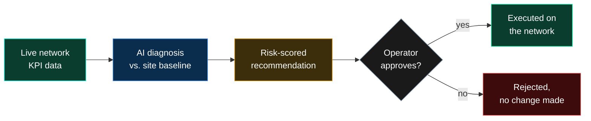
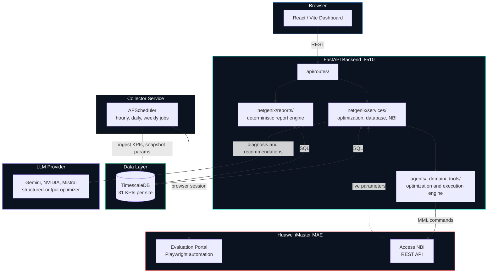
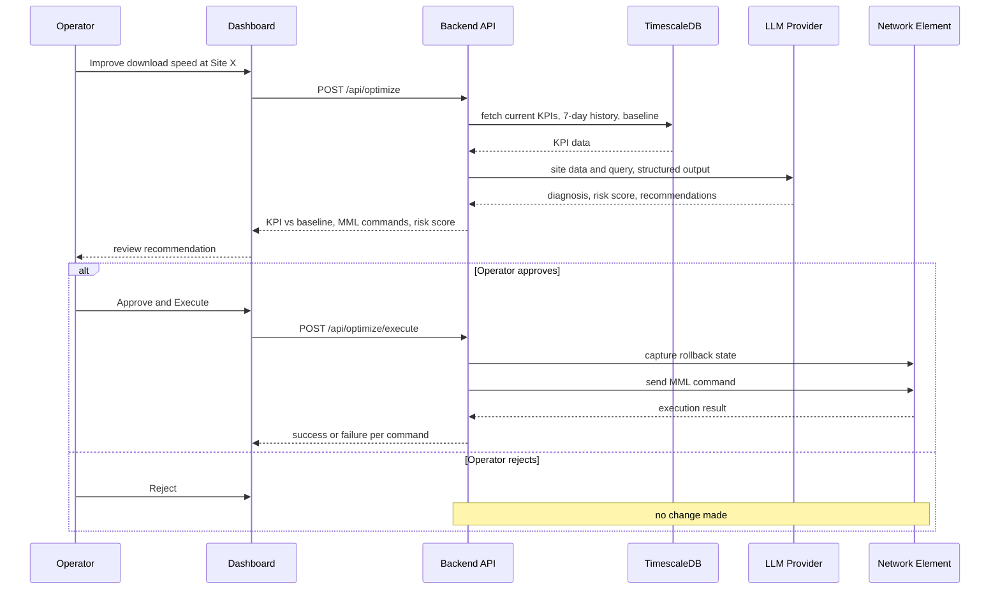

# NetGenix

**AI-powered network optimization for 4G/LTE radio access networks.**

NetGenix turns raw network performance data into ranked, explainable, actionable
recommendations — and, when approved, executes them directly on the network.

This document covers NetGenix from three angles: what it is and why it matters
(Overview), what it's worth (Value & Impact), and how it's built (Technical
Reference).

---

## 1. Overview

### The problem

Radio network optimization today is slow and expert-bottlenecked. A cell site
degrades — download speeds drop, access success dips, channel load climbs —
and diagnosing *why* means an engineer manually cross-referencing dozens of
KPIs against historical baselines, then hand-deriving a parameter change and
the exact vendor command syntax to apply it. At scale, across hundreds of
sites, this doesn't scale with the team.

### What NetGenix does

NetGenix continuously ingests live and historical KPI data from the network,
gives an operator a natural-language interface to ask "what's wrong with this
site" or "improve download speed here," and returns an AI-generated diagnosis
grounded in the site's own real performance history — not generic textbook
thresholds. Every recommendation comes with a risk score, an expected impact
statement, and the exact vendor command syntax ready to execute, gated behind
human approval.

**Core capabilities:**

- **AI Network Optimizer** — a conversational assistant that analyzes a site's
  current KPIs against its own calibrated operating baseline, diagnoses the
  root cause of underperformance, and recommends conservative parameter
  changes with a quantified risk score — never guessing, always citing the
  real numbers behind its verdict.
- **One-click execution** — approved recommendations are translated into
  live MML (Man-Machine Language) commands and pushed to the network element,
  with rollback state captured automatically before every change.
- **31-KPI live dashboard** — coverage, quality, throughput, retainability,
  mobility, and resource-utilization metrics per site, with historical
  trending and multi-metric overlay comparisons.
- **Automated reporting** — a rolling 7-day performance report is generated
  daily without manual intervention, alongside on-demand Excel/PDF exports
  with weighted site rankings.
- **Network health overview** — a site inventory heatmap and searchable,
  sortable drilldown table for triaging which sites need attention across
  the whole estate.

### Who it's for

Network operations teams running Huawei-based LTE infrastructure who need to
close the gap between "we have the data" and "we know what to do about it" —
without waiting on a senior RF engineer for every site that dips below
target.

### How it works, end to end



---

## 2. Value & Impact

### Time-to-diagnosis

What used to require pulling KPI exports, cross-referencing historical
averages, and manually identifying which of 31 tracked metrics is the actual
problem is now a single natural-language question, answered in under 30
seconds with a cited, numeric justification for every conclusion.

### From insight to action, in one flow

Most network analytics tools stop at the dashboard — a human still has to
translate "download speed is low" into the correct parameter, the correct
value, and the correct vendor syntax. NetGenix closes that loop: the same
AI analysis that identifies the issue produces the exact executable command,
with a risk score attached, so approval is a judgment call on the
recommendation — not a research project to construct one.

### Grounded, not generic

Every "healthy vs. degraded" call NetGenix makes is measured against that
specific site's own historical operating baseline, not an industry-standard
number that may not reflect real conditions on this network. That means
fewer false alarms, and — just as importantly — the AI will tell an operator
when a site is genuinely fine even if the request implied otherwise, with the
evidence to back it up.

### Always-current visibility

A rolling 7-day performance report regenerates automatically every day, so
network status is never more than a day stale. Manual, on-demand reports
remain available for any custom period, in both Excel (auditable, sortable)
and PDF (executive-ready) formats.

### Safety by design

Every optimization recommendation carries a quantified risk score before
execution. Rollback state is captured automatically ahead of any live change,
so a parameter adjustment is never a one-way door.

---

## 3. Technical Reference

### Architecture



- **Frontend**: React 18 + TypeScript, Vite, TanStack Query, Recharts, Tailwind.
- **Backend**: FastAPI, Pydantic, TimescaleDB (via `psycopg2`), LangChain/
  LangGraph for the LLM-driven optimization workflow.
- **LLM provider**: configurable (NVIDIA / Gemini / Mistral) via
  `config/config.yaml`; Gemini is the current default, called through
  structured output for reliable, schema-validated responses.
- **Data pipeline**: a scheduled collector service ingests KPI data from the
  Huawei iMaster MAE Evaluation portal (Playwright browser automation,
  session-persisted) into TimescaleDB on hourly (parameter snapshots), daily
  (KPI refresh + rolling 7-day report), and weekly cadences.
- **Execution**: approved recommendations are converted to Huawei MML syntax
  and sent via the Access NBI (Northbound Interface) REST API; live execution
  is explicitly gated by config, environment, and per-request flags.

### KPI catalog

31 KPIs tracked per site, grouped by category: Availability, Access,
Retainability, Mobility, Paging, Traffic, Users, Throughput, Quality,
Resource, Radio Quality, Latency, Data Quality. Each KPI carries a
network-calibrated operating-average baseline (not a generic target) used
both for the dashboard's healthy/watch status and as ground truth fed to the
AI optimizer.

### Optimizable parameters

The AI optimizer recommends changes across 5 parameters per site/cell:
Reference Signal Power, A3 Event Offset, T310 Timer, P0 Nominal PUSCH, and
PDCCH Aggregation Level — each mapped to its exact Huawei MML modify command.

### Local ports

- Backend: `8510`
- Frontend: `8511`

### Running locally

**Backend:**

```bash
cd netgenix
python3 -m uvicorn backend.main:app --host 0.0.0.0 --port 8510
```

**Frontend:**

```bash
cd netgenix/frontend
npm ci
VITE_API_URL=http://localhost:8510 npm run dev -- --host 0.0.0.0 --port 8511
```

**Full stack (Docker Compose):**

```bash
cd netgenix
docker compose up -d
```

### Verifying a deployment

```bash
curl -i http://localhost:8510/health
curl -s http://localhost:8510/api/sites
curl -s http://localhost:8510/api/status
curl -s http://localhost:8510/api/diagnostics/nbi
curl -i http://localhost:8511/
```

### One-command VM deployment

NetGenix now includes an explicit deployment command that keeps GitHub as the
source of truth and only updates the VM when you intentionally trigger it.

From the repository root:

```bash
export NETGENIX_VM_SSH_TARGET=user@your-vm-host
make deploy-netgenix-dry-run
make deploy-netgenix
```

Or from inside `netgenix/`:

```bash
export NETGENIX_VM_SSH_TARGET=user@your-vm-host
make preflight
make deploy-netgenix
```

What the deploy command does:

- verifies you are on the `netgenix` branch
- blocks deployment if disallowed local changes are present
- runs the local backend test command from `netgenix/`
- renders `docker compose config` locally before any push
- pushes `HEAD` to `origin/netgenix`
- uploads the local `netgenix/.env` to the VM over SSH
- pulls the exact pushed SHA on the VM
- rebuilds and re-spins the Docker Compose services in stages
- stops and rolls back on the VM if a stage fails

Useful environment overrides:

- `NETGENIX_VM_SSH_TARGET`: required SSH target in `user@host` form
- `NETGENIX_VM_REPO_ROOT`: defaults to `~/Cassava AI/Telco-Network-Configuration`
- `NETGENIX_VM_DATA_DIR`: defaults to `~/netgenix-data`
- `NETGENIX_TEST_COMMAND`: overrides the local preflight test command
- `NETGENIX_TEST_TIMEOUT`: timeout in seconds for the local test command
- `NETGENIX_RUN_LOCAL_SMOKE=1`: enables local curl checks against ports `8510` and `8511`

### Reporting

```mermaid
gantt
    dateFormat  HH:mm
    axisFormat  %H:%M
    title Daily automation cadence (collector/scheduler.py)
    section Every hour
    Parameter snapshot        :active, 00:05, 5m
    section Daily
    KPI ingest               :01:00, 15m
    Rolling 7-day report     :crit, 05:00, 20m
    section Thursday
    Weekly report            :06:00, 20m
```



- `POST /api/reports/automation/runs` — trigger a report run (manual or
  daily-rolling-window) against the Evaluation database.
- `GET /api/reports/automation/runs` — job history and status.
- `POST /api/reports/imports` / `GET /api/reports/runs/{run_id}/download` —
  file-first path: upload CSV/XLSX exports directly, get deterministic Excel
  + audit JSON back.
- Scheduled jobs (`collector/scheduler.py`): hourly parameter snapshots,
  daily KPI ingest, a daily rolling 7-day report, and a Thursday weekly
  report — all reusing the same report-generation pipeline.

### Optimization API



- `POST /api/optimize` — run the AI optimizer for a site/cell against a
  natural-language query; returns issue diagnosis, KPI-vs-baseline
  comparison, risk-scored recommendations, and generated MML commands.
- `POST /api/optimize/execute` — execute approved recommendations; dry-run
  by default, live execution gated by `NETGENIX_ALLOW_LIVE_MML` and
  per-request `execute_live`.

### Safety defaults

MML execution defaults to dry-run. Live Huawei credentials load only from
environment variables and must never be committed. Rollback state is
captured before every live parameter change.
